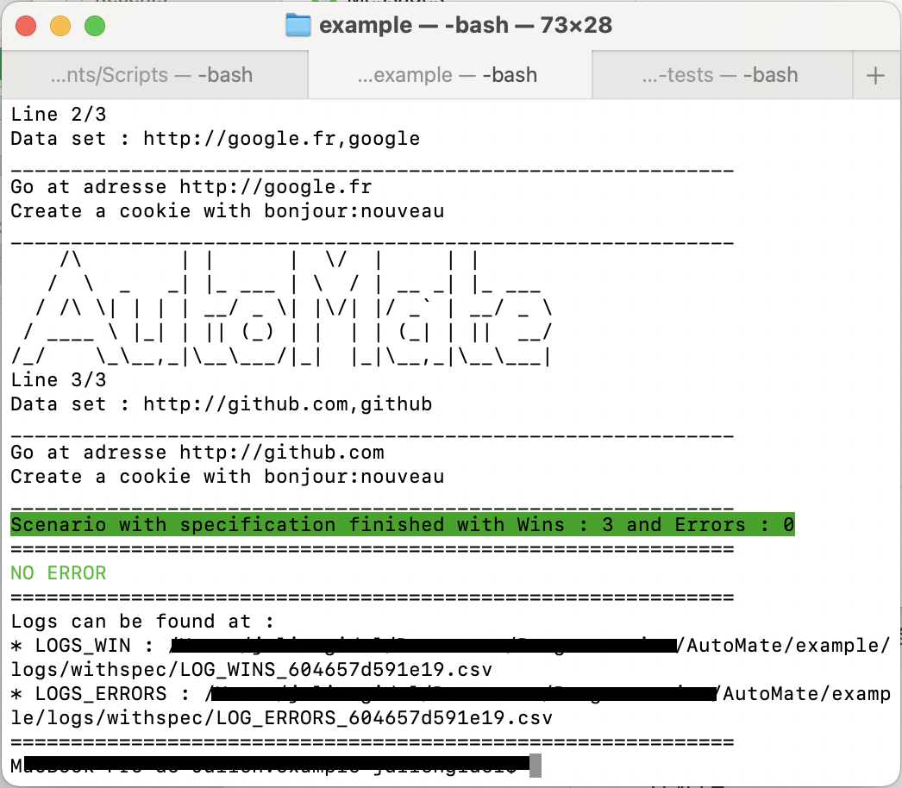

 [](https://codecov.io/gh/JuGid/AutoMate) [](//packagist.org/packages/jugid/auto-mate) [](//packagist.org/packages/jugid/auto-mate) [](//packagist.org/packages/jugid/auto-mate)


# AutoMate - Yaml automation library
*Release 0.3.0 see the [Changelogs](CHANGELOG.md)*

## Why AutoMate ?

At work, we need to make a lot of management acts. There is already a homemade framework which works well for this kind of actions. The thing is that it takes a long time to develop and create new scenarios. With AutoMate, I tried reducing this wasted time.

With AutoMate you can :
- Create multiple scenarios
- Run them on different browsers
- Inject data into them to use variable in the scenario and repeat the scenario for each dataset
- Get logs from files to know which data was used when the scenario failed/successed
- Have a step by step description written on console

## Getting started

### Installation 

**:arrow_right: Install AutoMate with composer**

```sh
composer install jugid/auto-mate
```

**:arrow_right: Get a Webdriver**

 - [Chromedriver](https://sites.google.com/a/chromium.org/chromedriver/downloads) : Chrome
 - [Geckodriver](https://github.com/mozilla/geckodriver/tree/v0.29.0) : Firefox
 - For Safari driver, see [Apple docs](https://developer.apple.com/documentation/webkit/testing_with_webdriver_in_safari)

**:arrow_right: Selenium Grid**

You can use Selenium Grid. See [Selenium Grid](https://www.selenium.dev/documentation/en/grid/) and [Selenium Grid 4 Downloads](https://www.selenium.dev/downloads/)

> If you do it, please send a PR with your example and a quick guide.

### Usage

To use AutoMate, you first need to :

1. Create your yaml configuration file
2. Create your scenario file with yaml
3. Create some folders corresponding to the scenario
4. Maybe create a specification csv file

**:arrow_right: Create you yaml configuration file**

Your configuration file should looks like [this](config/default-config.yaml). You MUST prefer using absolute path.

**:arrow_right: Create your scenario file with yaml**

A scenario is a list of steps that have to be executed by AutoMate. You also can declare variables and the browser to use for this specific scenario. You can find an example [here](example/scenario)

> Your scenario needs to be named `main.yaml` and saved in `scenario_folder/scenario_name/`

**:arrow_right: Create some folders corresponding to the scenario**

Now you have to create some folders corresponding to the scenario you just created.

* logs_folder/scenario_name/ : to log the results in details
* specs_folder/scenario_name/ : to load data in the scenario specification variables scope

**:arrow_right: Create your specification file**

Specification are csv files that provide data to AutoMate. It will execute the scenario for each lines and load data inside the spec variables scope.

Your specification files need to be saved in specs_folder/scenario_name/my_spec.csv.

> Your specification needs to have a header. Otherwise, your variables name will be the data at first line.

> You can create the number of specification you want. If AutoMate does not run in Test mode, the spec is renamed with the suffix `_PROCESSED` when the scenario run ends. The specification cannot be detected if it has `_PROCESSED` in its name.

## Visual

This is what AutoMate looks like :



## Support

First, you can find help on the [Wiki](https://github.com/JuGid/AutoMate/wiki). Then if you don't find what you want, you can contact us.

## Roadmap
*See [Changelogs](CHANGELOG.md) for more information*

- [x] Provide a Proxy management
- [x] Possibility to import a scenario for reusability
- [x] Firefox Profile
- [ ] Add a command `ajax` and `js` to work with ajax/js
- [ ] **Tell us your ideas ! You can directly send a PR or open an issue**

## Contributing

We love to have your help to make AutoMate better. 
See [CONTRIBUTING.md](.github/CONTRIBUTING.md) for more information about contributing and developing AutoMate

## License

AutoMate is under MIT License. You can find the license file at [License](LICENSE). 

## Thanks

 - [php-webdriver](https://github.com/php-webdriver/php-webdriver) for this amazing PHP binding solution
 - [PASVL](https://github.com/lezhnev74/pasvl) from Lezhnev74 for this array validation with patterns that help
 - [Symfony Config Component](https://github.com/symfony/config)
 - [Badge poser](https://poser.pugx.org) to provide an helper to pimp the README with great badges

 If you like AutoMate, do not hesitate to tell us how you love it and if you can, contribute.
